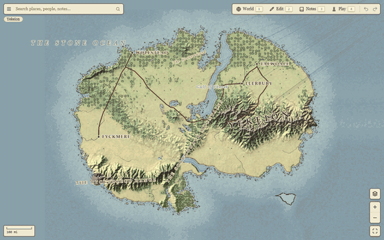
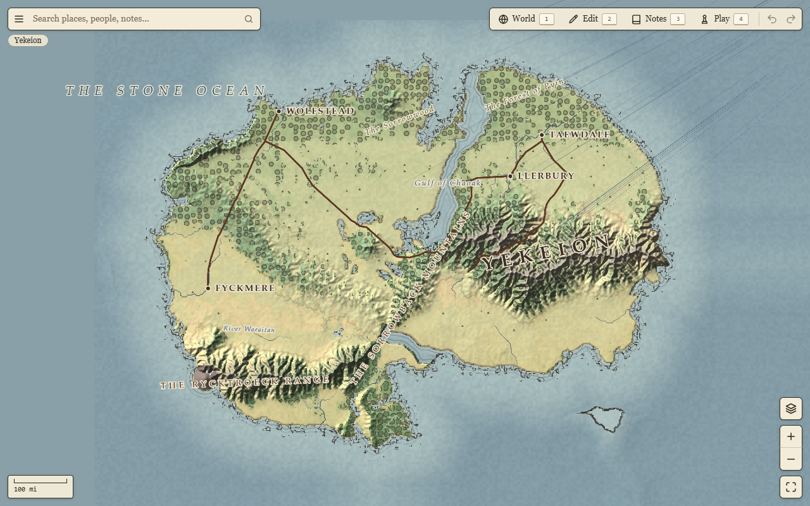
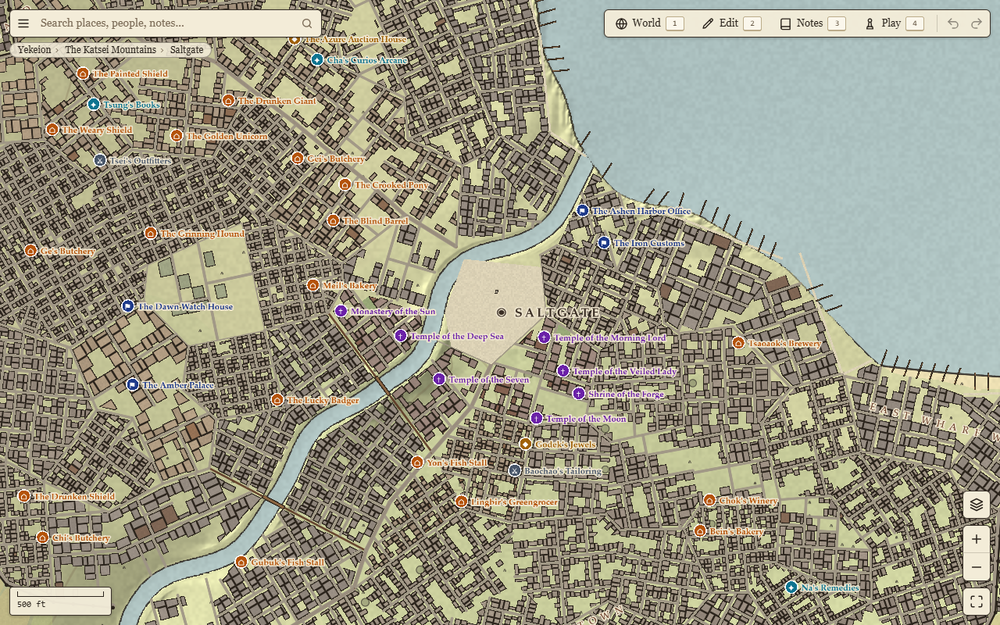
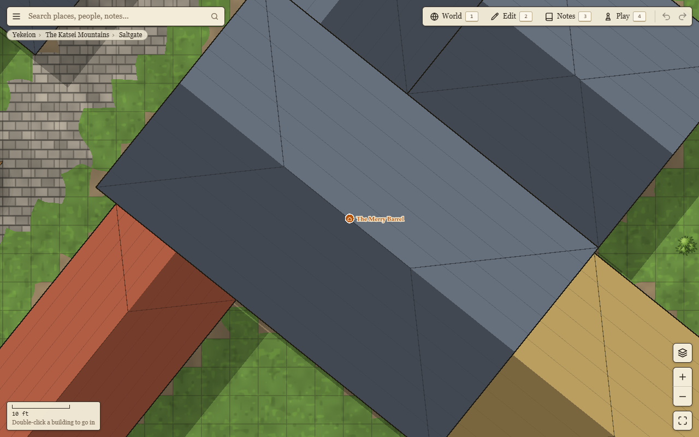
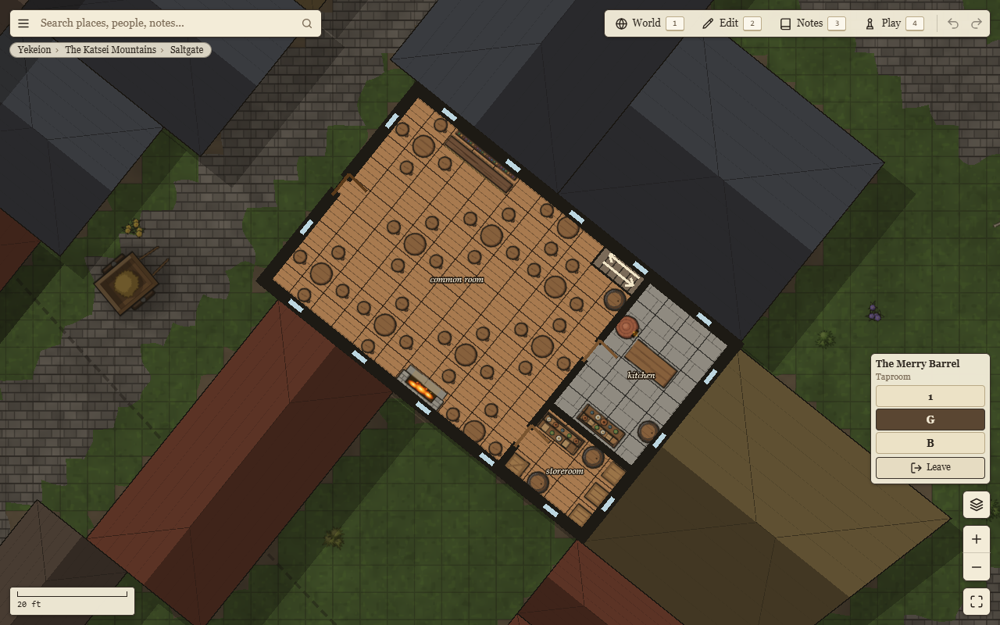
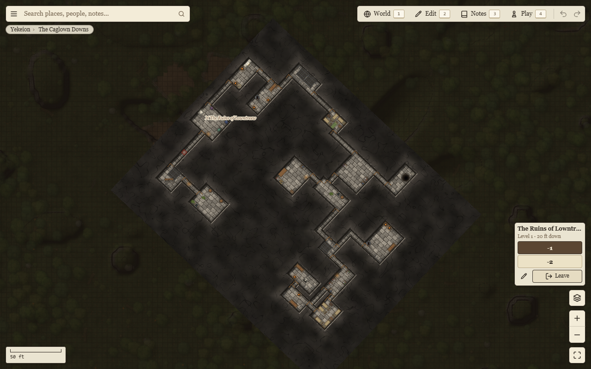

# Worldspring

**A whole fantasy world for your tabletop game, from the continent down to the battlemap, in your browser.**

**[Open Worldspring →](https://dun-john.github.io/worldspring/)** · **[Join the Discord](https://discord.gg/8ZS4nHWWVv)**



Worldspring generates a world from a single number (its *seed*). Zoom like a web map: coasts, mountain ranges,
rivers and roads at the top; regions, towns and dungeons on the way down; and at the bottom, battlemaps on a
5-foot grid where every building has its rooms and furniture, every ruin has its dungeon, and every city has its
sewers. Nothing is drawn by hand and nothing is stored on a server: the world is worked out in your browser as you
look at it, the same way every time for the same seed.

It's free, needs no account, and works on a laptop, tablet or phone with a current browser.

| | |
|---|---|
|  |  |
| **The continent**: biomes, ranges, rivers, seas, and the roads between towns, over bridges, fords and ferries. | **Cities** with walls, wards, markets, docks and named districts. |
|  |  |
| **Battlemaps** everywhere, on a 5-ft grid. | **Inside every building**, floor by floor. |



## Getting around

- **Pan** by dragging, **zoom** with the scroll wheel, a pinch, or the **+ / −** buttons.
- **Click** a place to see what it is; **double-click** (or double-tap) a building, a ruin or a cave mouth to go
  inside, and pick the floor or level at the side.
- **Search** (top left) finds towns, buildings, people and your notes by name.
- **☰** (top left) has the menu; **?** shows every keyboard shortcut.
- The four sections at the top right:
  - **World**: start a new world from a seed, change its size and climate, or *sketch* the continent you want
    (draw coasts, mountain ranges and masses, plateaus, rivers, lakes, volcanoes, towns and sites, roads, name
    regions, and the generator follows; or have only the roads you draw); save worlds and open them again.
  - **Edit**: rename anything, place your own towns and sites, draw buildings, change or remove a town's own (or
    clear a whole ward to build your own), put down bridges, fords and ferries, design dungeons room by room, and
    put down or clear objects on battlemaps (your own pictures too).
  - **Notes**: your notebook for the people and plots of your campaign, pinned to places on the map.
  - **Play**: run a session at the table. Tokens, fog of war, line of sight, lights, doors and secret doors, and a
    second **players' window** to put on a TV or another screen. It shows only what the players have seen.

## Your worlds stay in your browser

Everything you make (worlds, edits, notes, pictures) is kept in this browser on this device, nowhere else.

- **Back it up**: in **World › Library**, *Download file* saves the world with all its changes and pictures as one
  file. *Open a file…* brings it back, here or on another device. *Back up all* saves every world this browser
  keeps, with their changes and pictures, as one file; *Restore…* brings them all back. The app reminds you to
  download a world once you've changed a lot in it.
- **Share** a world with *Copy link* (World › Library): the link holds the world and its changes while they are few.
  For more changes, or pictures, send the file. (The address bar holds a big sketched world only by a short name
  that works in this browser.)
- Opening a world that brings its own changes (a file, a link, a saved world) over the ones you've made asks which
  to keep: yours, its own, or none. Nothing is mixed.
- Clearing this site's data in your browser settings deletes your worlds, so download the ones you care about.

## Versions

Worldspring keeps improving its generator, and a newer generator may put rivers, roads and towns in other places.
So that your worlds never change under you, every version of the generator stays on the site. When you open a world
made with an older one, you choose: **open it as it was made** (exactly as before), or **upgrade** it to the newest
(and check that your changes still sit where they should).

## Community

Come to the **[Worldspring Discord](https://discord.gg/8ZS4nHWWVv)** to show the worlds you've made, ask for help,
suggest ideas and report bugs (the seed and where it happened help a lot). The ☰ menu in the app links there too.

## Notes

- Worldspring needs WebGL2 (any current Chrome, Edge, Firefox or Safari). Very large cities can be heavy on phones
  with little memory.
- Game rules aren't built in: play mode works with any system.
- Worldspring also has a local agent server (MCP tools for AI assistants, see [docs/AGENT.md](docs/AGENT.md)) that
  runs only on your own computer; it isn't part of the website.

## Running it yourself

The generator is Rust compiled to WebAssembly; the app is TypeScript, Svelte 5 and PixiJS (WebGL2).

You need Rust (stable, with `rustup target add wasm32-unknown-unknown`), `wasm-bindgen-cli` at the version in
`Cargo.lock` (`cargo install wasm-bindgen-cli --version 0.2.129`) and Node 22 or later.

```sh
npm --prefix app install
npm run wasm     # build the generator into app/src/gen/pkg
npm run dev      # http://localhost:5173 (?seed=N picks a world)
```

`npm run mapd` starts the local agent server, `cargo test --release -p worldgen` runs the checks and `npm run check`
type-checks the app. On a network share (a UNC path, or a drive mapped to one) the dev server polls for changed
files instead of watching them, which fails there; `WS_POLL=1` turns polling on anywhere (a share mounted on Linux
or macOS, say).

## Inspiration

Worldspring stands on the shoulders of two wonderful map makers. Go and try them:

- **[Watabou's Procgen Arcana](https://watabou.github.io/)**: cities, villages, dungeons and more, each made from a
  seed in the browser, in a lovely ink-on-parchment style. The towns here owe a lot to them.
- **[Canvas of Kings](https://store.steampowered.com/app/2498570/Canvas_of_Kings/)** by Hannes Breuer: hand-drawn
  maps where you draw the paths and plots and the details fill themselves in.

## License

© 2026 Dun-John. All rights reserved. The source is published so that it can be read; no license is granted to
copy, modify or redistribute it. You're welcome to use the website and the worlds you make with it.

Third-party notices: [THIRD_PARTY_NOTICES.md](THIRD_PARTY_NOTICES.md).
